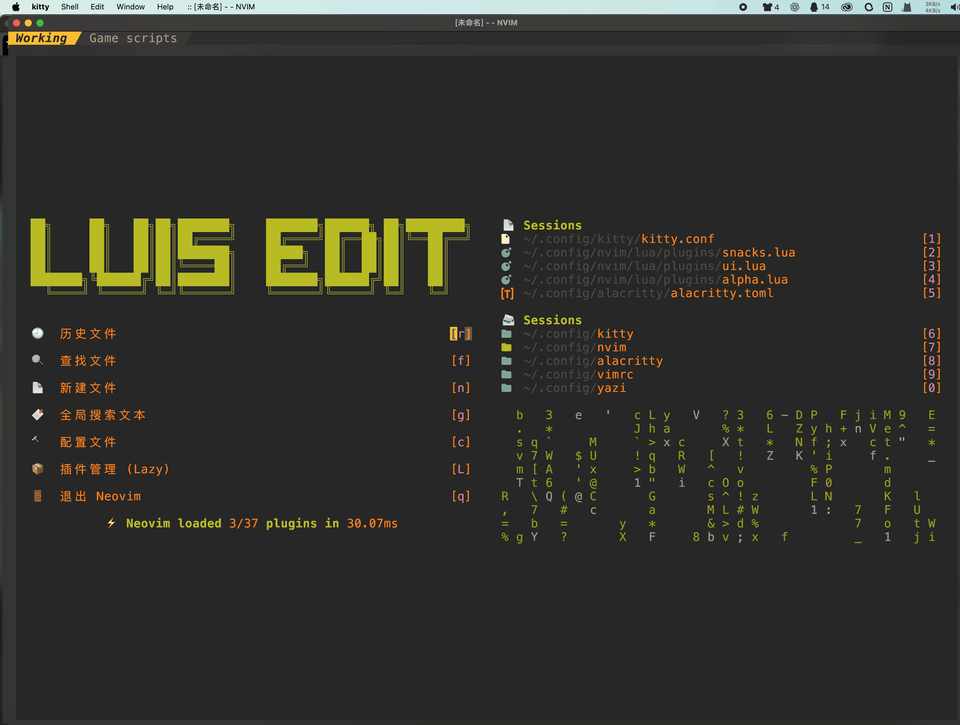
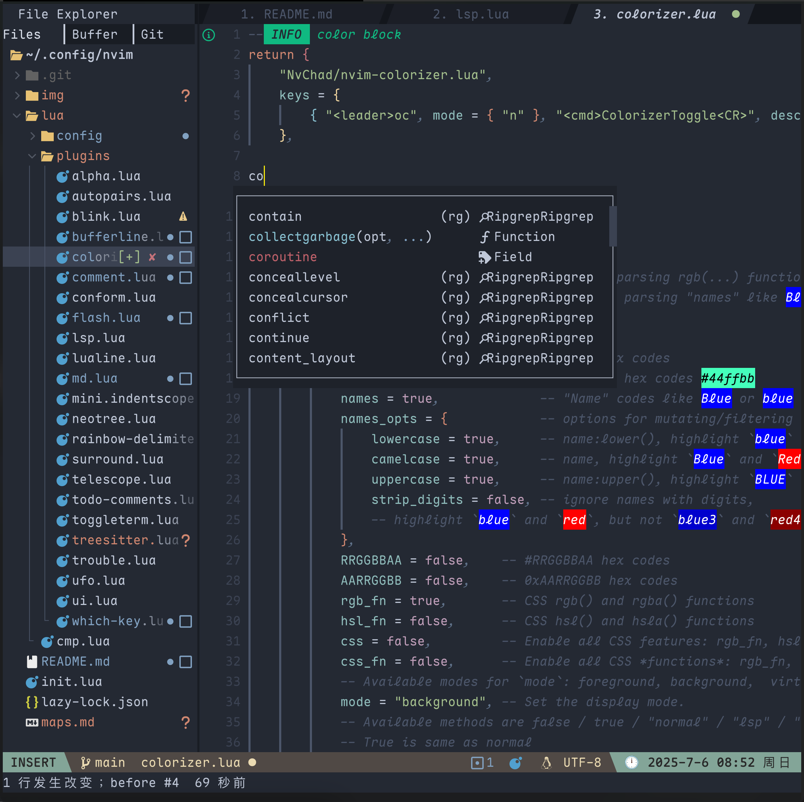

# 🧠 nvim-config 使用说明

## 界面





---

**高性能·模块化·开箱即用**: 适用于开发者的 Neovim 配置，支持 LSP、自动补全、代码格式化、语法高亮、美化 UI 等功能。


---

## 🧰 必须软件（外部依赖）

以下是使用本配置前需要在系统中安装的软件：

| 工具名称            | 作用说明                                    |
|---------------------|---------------------------------------------|
| 🧹 **stylua**       | Lua 代码格式化工具，自动格式化 Lua 插件代码 |
| 🔍 **ripgrep (rg)** | 快速文本搜索工具，Telescope 模糊搜索依赖    |
| 🗜️ **gcc**          | 编译 C 插件时使用（如 Treesitter）          |

### 🧪 可选推荐依赖：

| 工具名称                   | 用途                                                                                          |
|----------------------------|-----------------------------------------------------------------------------------------------|
| 🐍 **Python 3** + `pynvim` | 支持 Python 插件（如一些 LSP 工具）                                                           |
| 🧵 **Node.js** + `npm`     | 安装 LSP/格式化工具（如 tsserver、prettier）                                                  |
| 🛠 **make**                | 某些插件需要构建步骤（如 `telescope-fzf-native`）                                             |
| 🌀 **Nerd Font**           | [Nerd Font](https://www.nerdfonts.com/#home) 是内置图标的编程字体，用于美化终端和编辑器界面。 |
| 🔯**cmatrix**              | 主页数字雨特效工具                                                                            |

## 🧹 清除旧配置（重装建议）

如需重新安装配置，先清除旧版本相关目录：

```sh
rm -rf ~/.config/nvim/ ~/.local/share/nvim/ ~/.local/state/nvim/ ~/.cache/nvim/
```

这将删除：

- `~/.config/nvim/`：主配置文件夹
- `~/.local/share/nvim/`：插件安装目录
- `~/.local/state/nvim/`：状态信息
- `~/.cache/nvim/`：缓存目录

## ⛓️‍💥 克隆配置文件

```sh
git clone --depth 1 https://github.com/Hello-LuisWu/nvim-config.git ~/.config/nvim
```

## 🗃️ Files

nvim 主目录文件树

```sh

├── img
│   ├── edit.png
│   └── star.gif
├── init.lua
├── lazy-lock.json
├── lua
│   ├── cmp.lua
│   ├── config
│   │   ├── autocmds.lua
│   │   ├── hl.luaaaa
│   │   ├── keymaps.lua
│   │   ├── lazy.lua
│   │   ├── options.lua
│   │   └── s.lua
│   └── plugins
│       ├── aerial.lua
│       ├── alpha.lua
│       ├── autopairs.lua
│       ├── blink.lua
│       ├── bufferline.lua
│       ├── colorizer.lua
│       ├── comment.lua
│       ├── conform.lua
│       ├── flash.lua
│       ├── gemini.lua
│       ├── lsp.lua
│       ├── lspsaga.lua
│       ├── lualine.lua
│       ├── md.lua
│       ├── mini.indentscope.lua
│       ├── neotree.lua
│       ├── rainbow-delimiters.lua
│       ├── snacks.lua
│       ├── surround.lua
│       ├── todo-comments.lua
│       ├── toggleterm.lua
│       ├── treesitter.lua
│       ├── trouble.lua
│       ├── ufo.lua
│       ├── ui.lua
│       └── which-key.lua
├── maps.md
├── README-CN.md
├── README.md
├── stylua.toml
└── vscodeVim
    └── settings.json
```

## 🚀 启动与首次初始化

第一次运行：

```sh
nvim
```
初始化过程中，[Lazy.nvim](https://github.com/folke/lazy.nvim) 会自动：
- 同步并安装所有插件
- 设置基础配置
- 构建所需模块（如 [Treesitter](https://www.github.com/nvim-treesitter/nvim-treesitter) 、高性能搜索器等）

如果报错，请根据提示手动安装缺失依赖。

> 你可以在这里查看所有的快捷键映射：👉 [keymaps](https://github.com/Hello-LuisWu/nvim-config/blob/main/maps.md) 

欢迎提交 [issue](https://github.com/Hello-LuisWu/nvim-config/issues) 或联系作者优化配置：[Luis Wu](https://www.github.com/Hello-LuisWu/nvim-config) 

