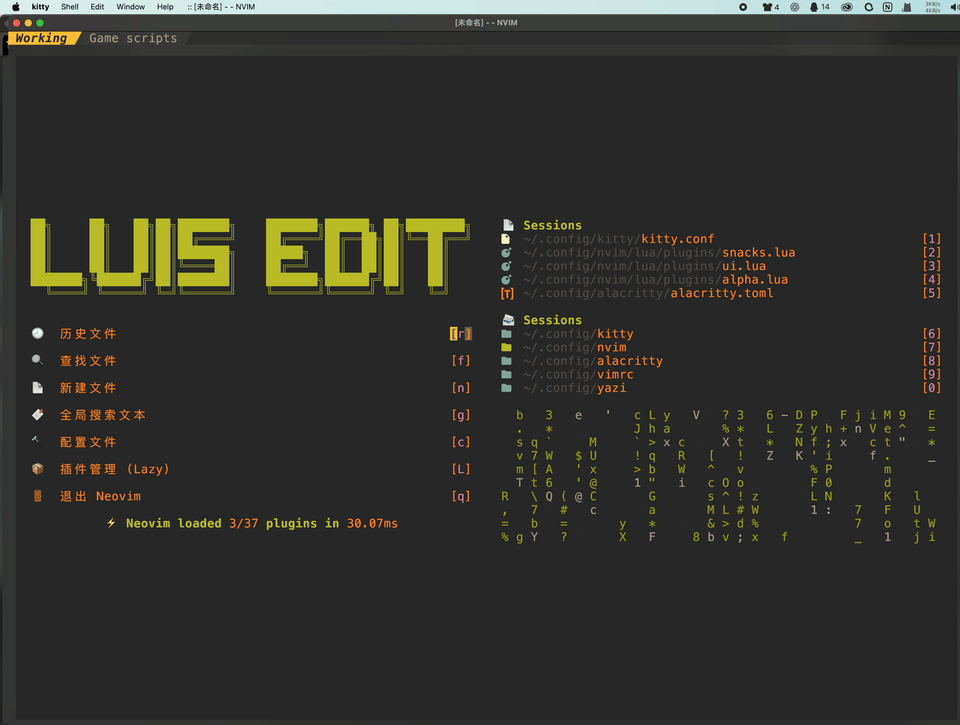
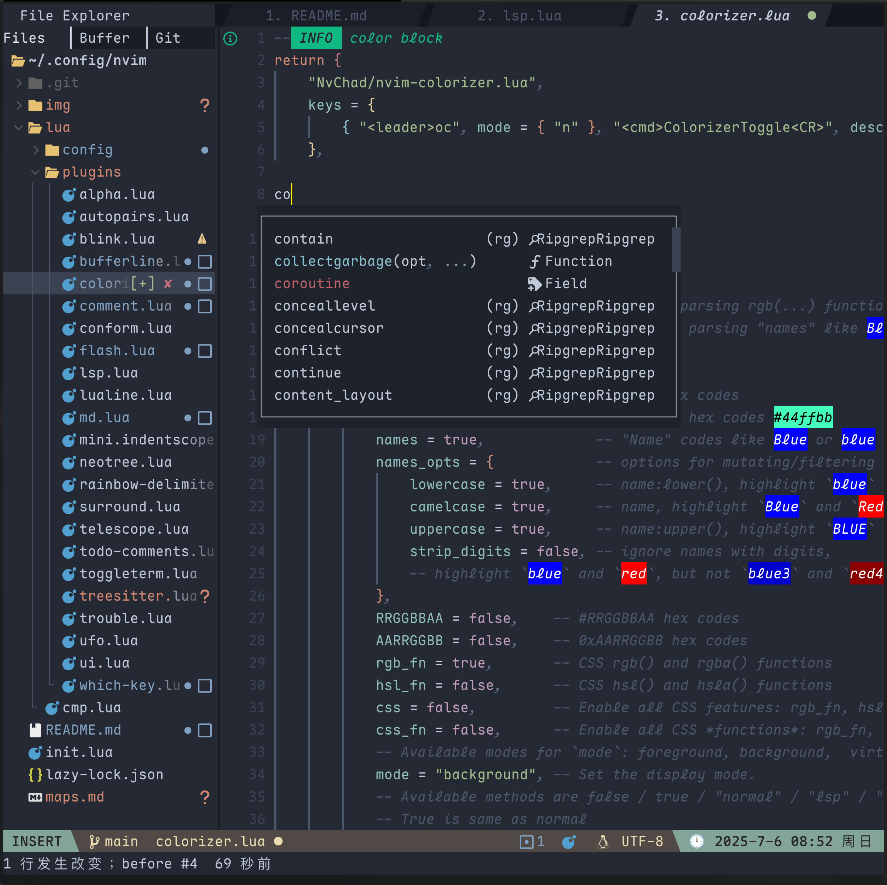

# 🧠 nvim-config User Guide

## 界面





---

**高性能·模块化·开箱即用**: 适用于开发者的 Neovim 配置，支持 LSP、自动补全、代码格式化、语法高亮、美化 UI 等功能。

---

## 🧰 所需外部依赖软件

以下是使用本配置前需要在系统中安装的软件：

- 💚[neovim](https://neovim.io/doc/install/): >= 0.12
- 🐙 [Git](https://git-scm.com/install/): 版本 >= 2.19.0（支持部分克隆）
- 🔍 [**ripgrep (rg)**](https://github.com/BurntSushi/ripgrep):  快速文本搜索工具，Telescope 模糊搜索依赖
- 🌳 [tree-sitter-cli](https://github.com/tree-sitter/tree-sitter/blob/master/crates/cli/README.md):  treesitter 所需依赖
    - 🗜️ **gcc**：编译 C 插件时使用（如 Treesitter）
- [pyright](https://github.com/microsoft/pyright): python 的语言服务器. 安装: `npm i -g pyright`
- clangd: c/c++ 语言服务器
    - clang: c/c++ 编译器, clangd所需依赖. arch安装: `sudo pacman -S clang`
- 🧵 [Node.js](https://nodejs.org/zh-cn/download): 安装 LSP/格式化工具（如 tsserver、prettier、markdown-preview）
- 🌀 [Nerd Font](https://www.nerdfonts.com/#home):（可选）v3.0 或更高版本, **Nerd Font**  是内置图标的编程字体，用于美化终端和编辑器界面。
- 🛠 **make**: 某些插件需要构建步骤（如 `telescope-fzf-native`）
- 🌿 [lazygit](https://github.com/jesseduffield/lazygit) （可选）: git 管理工具
- 🌐 [curl](https://curl.se/download.html): 用于blink.cmp （补全引擎）

## 🧹 清除旧配置（重装建议）

如需重新安装配置，先清除旧版本相关目录：

```sh
# macOS/Linux
## 备份旧配置
mv ~/.config/nvim{,.bak}
mv ~/.local/share/nvim{,.bak}
mv ~/.local/state/nvim{,.bak}
mv ~/.cache/nvim{,.bak}
## 或者删除旧配置
rm -rf ~/.config/nvim/ ~/.local/share/nvim/ ~/.local/state/nvim/ ~/.cache/nvim/


# Windows
## 备份旧配置
Move-Item $env:LOCALAPPDATA\nvim $env:LOCALAPPDATA\nvim.bak
Move-Item $env:LOCALAPPDATA\nvim-data $env:LOCALAPPDATA\nvim-data.bak
```

将删除以下目录(macOS/Linux)：

- `~/.config/nvim/`：主配置目录
- `~/.local/share/nvim/`：插件安装目录
- `~/.local/state/nvim/`：状态信息目录
- `~/.cache/nvim/`：缓存目录

## ⛓️‍💥 克隆配置文件

```sh
# macOS/Linux
git clone --depth 1 https://github.com/Hello-LuisWu/nvim-config ~/.config/nvim

# Windows
git clone --depth 1 https://github.com/Hello-LuisWu/nvim-config $env:LOCALAPPDATA\nvim
```

## 🗃️ Files

nvim 主目录文件树

```sh
.
├── init.lua
├── lua
│   ├── config
│   │   ├── autocmd.lua
│   │   ├── keymap.lua
│   │   ├── lsp.lua
│   │   ├── option.lua
│   │   └── pack.lua
│   ├── plugins
│   │   ├── align.lua
│   │   ├── alpha.lua
│   │   ├── autopairs.lua
│   │   ├── blink.lua
│   │   ├── comment.lua
│   │   ├── flash.lua
│   │   ├── mason.lua
│   │   ├── md.lua
│   │   ├── neotree.lua
│   │   ├── surround.lua
│   │   ├── telescope.lua
│   │   ├── todo-comments.lua
│   │   ├── ufo.lua
│   │   └── wk.lua
│   └── utils
│       └── loader.lua
├── m.md
└── nvim-pack-lock.json
```

## 🚀 启动与首次初始化

第一次运行：

```sh
nvim
```

> **注意：** 首次启动 Neovim 时，需要从 [GitHub](https://www/github.com) 下载并克隆插件到本地; treesitter 也要从 GitHub 下载语法解析器。请确认当前网络可以正常访问 GitHub；如果无法访问，请先配置代理后再启动 Neovim，否则插件将无法正常安装和运行。

如果报错，请根据提示排除，检查网络问题，或手动安装缺失依赖。

> 你可以在这里查看所有的快捷键映射：👉 [keymaps](https://github.com/Hello-LuisWu/nvim-config/blob/main/maps.md) 

欢迎提交 [issue](https://github.com/Hello-LuisWu/nvim-config/issues) 或联系作者优化配置：[Luis Wu](https://www.github.com/Hello-LuisWu/nvim-config) 

